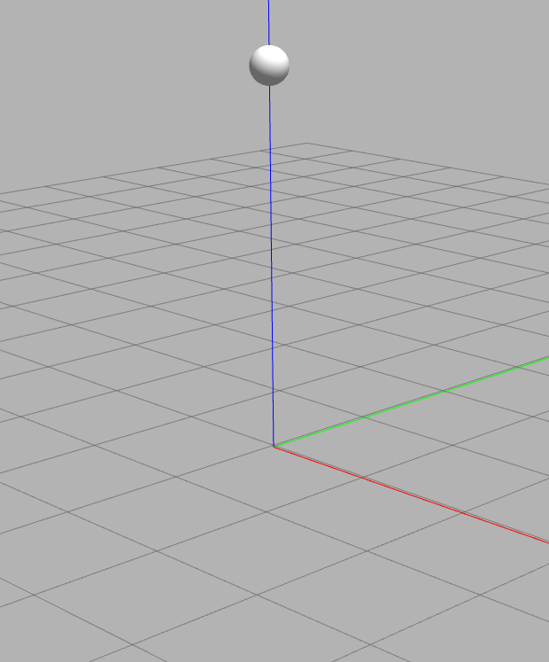

freebuoyancy_gazebo
===================

A Gazebo plugin to simulate underwater vehicles.

<p align="center">
  
</p>

## Gazebo plugin
The package builds two Gazebo plugins:

- freebuoyancy_gazebo (model plugin)
simulates buoyancy and viscous force from water

### Install
```bash
git clone https://github.com/bluerobotics/freebuoyancy_gazebo
cd freebuoyancy_gazebo
mkdir build
cd build
cmake ..
make
sudo make install
```

### Test it
```bash
source gazebo.sh
gazebo worlds/freebuoyancy_demo.world -u
```

## Troubleshooting

If you are running gazebo7, probably you'll find a [bug in the GAZEBO_PLUGIN_PATH env variable](https://github.com/ros-infrastructure/reprepro-updater/issues/41).
To solve that issue, it's necessary to move all plugins to the correct path.

```
sudo cp -a /usr/lib/x86_64-linux-gnu/gazebo-7.0/plugins/ /usr/lib/x86_64-linux-gnu/gazebo-7/
```

## References

This plugin is based on the original repository of [freefloating_gazebo](https://github.com/freefloating-gazebo/freefloating_gazebo),
this is only a rework to use without ROS.
